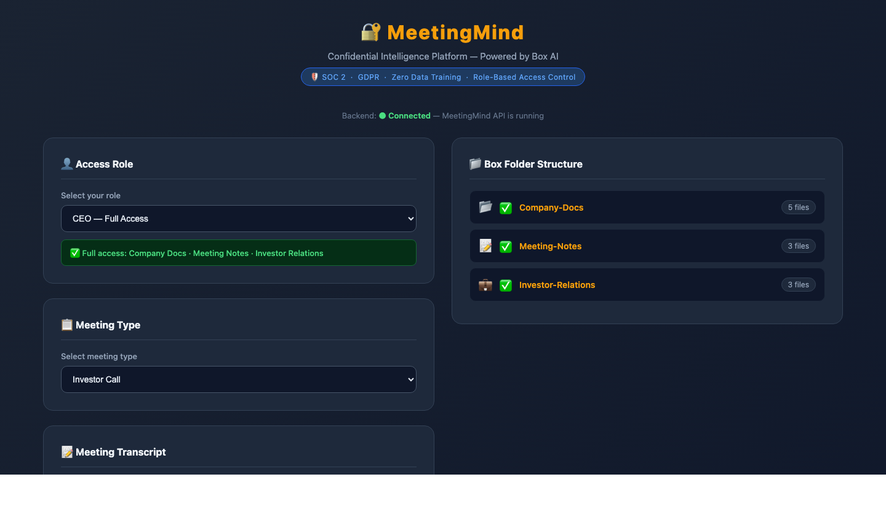
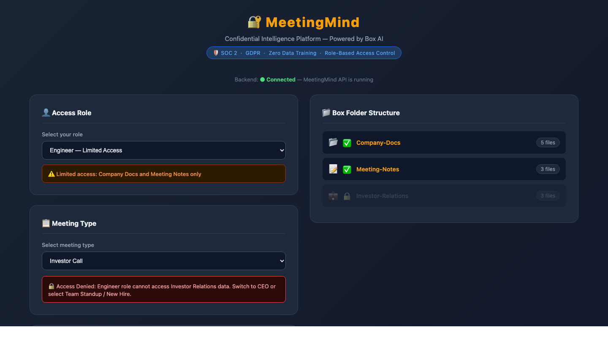
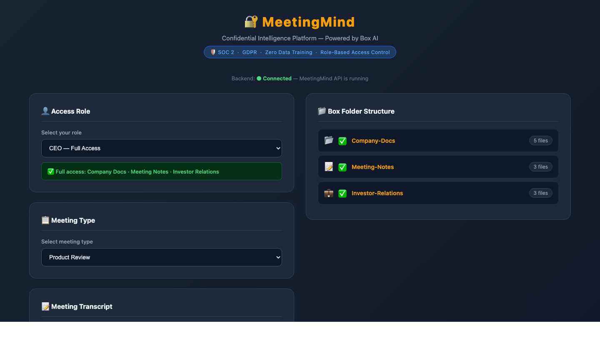
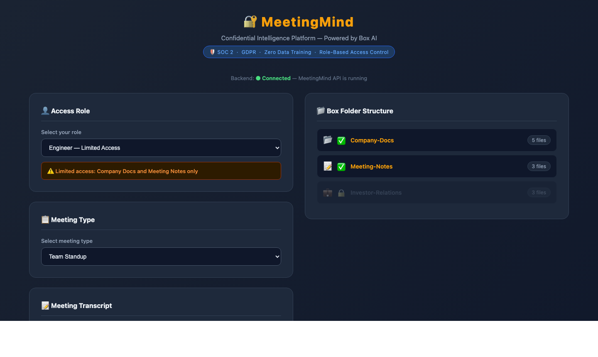

# 🔐 MeetingMind

### Confidential Meeting Intelligence Platform: Powered by Box AI + Anthropic Claude

<div align="center">

[](https://developer.box.com/guides/box-ai/)
[](https://www.anthropic.com/)
[](https://fastapi.tiangolo.com/)
[](https://www.python.org/)
[](https://github.com/box/box-python-sdk-gen)
[](https://www.uvicorn.org/)
[](https://developer.mozilla.org/en-US/docs/Web/JavaScript)
[](LICENSE)

</div>

> *"Paste a transcript. Get decisions, action items, company context, and a visual diagram — all saved to Box automatically."*

---



---

## 🎬 What It Does

MeetingMind automates meeting intelligence by combining **Box AI** with **Anthropic Claude**. Paste any meeting transcript and the platform:

- Queries your **company knowledge base in Box** for relevant context
- Extracts **key decisions and action items** using `claude-haiku-4-5`
- Generates a **structured summary** and saves it back to Box automatically
- Renders an **AI-generated SVG meeting diagram** via `claude-sonnet-4-6`
- Enforces **role-based access control** (CEO vs Engineer permissions)

---

## 📸 Screenshots

### Role-Based Access Control

| CEO - Full Access | Engineer - Limited Access |
|:---:|:---:|
|  |  |
| All three Box folders accessible and linked | Investor-Relations folder locked; access denied warning shown |

### Meeting Types

| CEO - Product Review | CEO - Team Standup |
|:---:|:---:|
|  |  |
| Full access - Product Review selected | Team Standup with transcript pre-filled, ready to process |

### Engineer - Allowed vs. Blocked

| Engineer - Team Standup | Engineer - Investor Call |
|:---:|:---:|
|  |  |
| Engineer can process Team Standup meetings | Engineer blocked from accessing Investor Relations data |

---

## ⚙️ Architecture

```
[Vanilla JS Frontend]  →  POST /process-meeting
          ↓
   [FastAPI Backend]
          ↓
  ┌───────┴────────┐
  ↓                ↓
[Box AI Ask API]  [Anthropic Claude API]
(company context)  (decisions + actions)
  ↓                ↓
  └───────┬────────┘
          ↓
 [Box SDK Gen - Upload]
 Meeting-Notes Folder in Box
```

---

## 🛠️ Tech Stack

| Layer | Technology |
|---|---|
| Backend API | Python 3.13 - FastAPI - Uvicorn |
| AI - Transcript Analysis | Anthropic `claude-haiku-4-5` |
| AI - Diagram Generation | Anthropic `claude-sonnet-4-6` |
| Document Storage | Box (via `box-sdk-gen` v1.3.0) |
| Authentication | Box Developer Token |
| Frontend | Vanilla HTML / CSS / JavaScript |

---

## 📁 Project Structure

```
meetingmind-box-ai/
├── assets/                        ← Screenshots
├── Data/
│   ├── Company-Docs/              ← Product roadmap, architecture, org chart, term sheet
│   ├── Investor-Relations/        ← Investor meeting notes, fundraising strategy, board updates
│   └── Meeting-Notes/             ← AI-generated summaries are saved here via Box API
└── meetingmind/
    ├── requirements.txt
    ├── frontend-new/
    │   └── index.html             ← Single-page frontend (no build step required)
    └── backend/
        ├── main.py                ← FastAPI app, processing pipeline, Claude integration
        ├── box_client.py          ← Box SDK Gen auth + file upload
        └── .env                   ← Secrets (not committed)
```

---

## 🚀 Getting Started

### 1. Clone the repo

```bash
git clone https://github.com/MansiMore99/meetingmind-box-ai.git
cd meetingmind-box-ai
```

### 2. Install dependencies

```bash
cd meetingmind
python3 -m venv .venv
source .venv/bin/activate
pip install -r requirements.txt
```

### 3. Configure environment variables

Create `meetingmind/backend/.env`:

```env
BOX_DEVELOPER_TOKEN=your_box_developer_token
ANTHROPIC_API_KEY=your_anthropic_api_key
COMPANY_DOCS_FOLDER_ID=your_folder_id
MEETING_NOTES_FOLDER_ID=your_folder_id
INVESTOR_RELATIONS_FOLDER_ID=your_folder_id
```

### 4. Start the backend

```bash
cd meetingmind/backend
uvicorn main:app --host 0.0.0.0 --port 8000 --reload
```

### 5. Open the frontend

```bash
cd meetingmind/frontend-new
python3 -m http.server 3000
```

Navigate to [http://localhost:3000](http://localhost:3000)

---

## 🔁 AI Processing Flow

```
User pastes transcript
        ↓
FastAPI /process-meeting
        ↓
Box AI Ask API ──────────────→ Relevant company context
        ↓
Anthropic claude-haiku-4-5 ──→ Decisions + Action Items
        ↓
Structured summary assembled
        ↓
Box SDK Gen uploads .txt ────→ Meeting-Notes folder
        ↓
Anthropic claude-sonnet-4-6 → SVG meeting diagram
        ↓
Result returned to frontend
```

---

## 📡 API Endpoints

| Method | Endpoint | Description |
|---|---|---|
| `GET` | `/` | Health check |
| `POST` | `/process-meeting` | Run full pipeline: context + extraction + Box upload |
| `GET` | `/folder-structure` | Returns Box folder metadata and file counts |

---

## ✅ Features

- **AI transcript analysis** - Uses `claude-haiku-4-5` to extract decisions and action items
- **Box AI document search** - Pulls relevant context from company knowledge base stored in Box
- **Auto-generated summaries** - Saves structured meeting summary to Box Meeting-Notes folder
- **Visual meeting diagram** - Generates SVG flowchart via `claude-sonnet-4-6`
- **Role-based access control** - CEO and Engineer roles with different folder permissions
- **Compliance-ready** - SOC 2 - GDPR - Zero Data Training - RBAC

---

## 📬 Let's Connect

<p align="center">
  <a href="https://www.linkedin.com/in/mansimore9/">
    
  </a>
 <a href="https://mansimore.dev/">
  
</a>
  <a href="https://medium.com/@mansi.more943">
    
  </a>
  <a href="https://x.com/MansiMore99">
    
  </a>
  <a href="https://www.youtube.com/@tech-girl-mm">
    
  </a>
</p>

